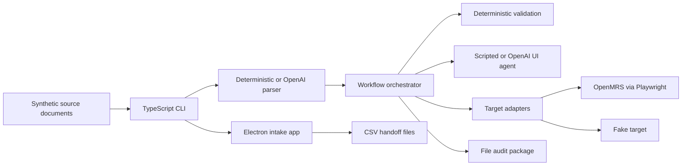
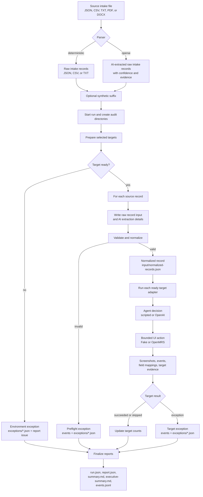

# Agentic UI Automation

Pilot for repeatable, audited UI data entry across web and desktop applications.

The workflow takes synthetic intake source documents, uses AI by default to
extract intake records, validates them deterministically, asks an agent driver to
approve bounded UI actions, runs one or more target adapters, and writes a
traceable audit package for each run.

## Contents

- [What It Demonstrates](#what-it-demonstrates)
- [Current Status](#current-status)
- [Architecture](#architecture)
- [Data Flow](#data-flow)
- [Quick Start](#quick-start)
- [Desktop Intake App](#desktop-intake-app)
- [Handoff Watcher](#handoff-watcher)
- [OpenMRS Smoke](#openmrs-smoke)
- [Audit Artifacts](#audit-artifacts)
- [CLI](#cli)
- [Development](#development)
- [Project Layout](#project-layout)
- [Keeping This Current](#keeping-this-current)

## What It Demonstrates

- Last-mile UI automation when an API is unavailable or incomplete.
- AI-assisted parsing for variable source documents before deterministic
  validation and EMR entry.
- Deterministic orchestration around agentic screen interpretation.
- Structured exception handling instead of silent target failures.
- Audit evidence for every run: screenshots, event logs, normalized input,
  exception JSON, run metadata, a Markdown summary, and structured report JSON.
- Target adapters for audited EMR entry:
  - Web app: OpenMRS through Playwright.
  - Fake target: deterministic local smoke target for orchestration and audit.

Use only synthetic data with this repository. The checked-in records under
`data/demo/` are intentionally synthetic.

## Current Status

- Core workflow: implemented and covered by tests.
- Fake target: deterministic local smoke target for orchestration and audit.
- OpenMRS web target: adapter and tests are implemented; live smoke requires a
  reachable synthetic/demo OpenMRS instance and current credentials.
- Desktop intake app: Electron shell opens with seeded synthetic records,
  supports optional import, and exports CSV handoff files.
- Handoff watcher: separate CLI command processes exported files and runs the
  existing audited workflow.

## Architecture

The workflow is a TypeScript CLI that turns synthetic intake source documents
into audited UI data-entry runs. It uses OpenAI for optional source parsing and
agent decisions, deterministic TypeScript validation for safety gates,
Playwright for OpenMRS browser automation, and Electron for the local intake
queue and CSV handoff app.

| Layer | Technology | Role |
| --- | --- | --- |
| Runtime and CLI | ![Node.js][node-badge] ![TypeScript][typescript-badge] | Runs the CLI, orchestrator, target adapters, and audit writers. |
| AI parsing and agent decisions | ![OpenAI][openai-badge] | Extracts variable intake documents and optionally approves bounded UI actions. |
| Validation contract | ![Zod][zod-badge] | Defines schemas for CLI config, records, agent decisions, and target results. |
| Web target | ![Playwright][playwright-badge] ![OpenMRS][openmrs-badge] | Automates synthetic patient entry in browser-based OpenMRS demo environments. |
| Desktop intake app | Electron | Reviews seeded or imported synthetic intake records and exports CSV handoff files. |
| Audit and verification | ![JSON][json-badge] ![Markdown][markdown-badge] ![Vitest][vitest-badge] | Writes run artifacts, reports, event logs, screenshots, and test coverage. |

[node-badge]: https://img.shields.io/badge/Node.js-5FA04E?logo=nodedotjs&logoColor=white
[typescript-badge]: https://img.shields.io/badge/TypeScript-3178C6?logo=typescript&logoColor=white
[openai-badge]: https://img.shields.io/badge/OpenAI-412991?logo=openai&logoColor=white
[zod-badge]: https://img.shields.io/badge/Zod-3E67B1?logo=zod&logoColor=white
[playwright-badge]: https://img.shields.io/badge/Playwright-2EAD33?logo=playwright&logoColor=white
[openmrs-badge]: https://img.shields.io/badge/OpenMRS-005A70
[json-badge]: https://img.shields.io/badge/JSON-000000?logo=json&logoColor=white
[markdown-badge]: https://img.shields.io/badge/Markdown-000000?logo=markdown&logoColor=white
[vitest-badge]: https://img.shields.io/badge/Vitest-6E9F18?logo=vitest&logoColor=white



## Data Flow



The data flow converts source documents into raw intake records, applies
deterministic validation before target entry, records all successful and
exceptional paths, and finishes with the audit contract under `runs/<run-id>/`.

## Quick Start

Install dependencies:

```sh
npm install
```

Run the no-UI demo first:

```sh
npm run dev -- run --input data/demo/intake-records-normalized.json --targets fake --runs-dir runs --parser deterministic
```

Expected result:

- `status` is `completed_with_exceptions`.
- `preflightExceptions` is `3`.
- `targetCounts.fake.succeeded` is `3`.

The status includes exceptions because the demo file contains three
intentionally invalid records that should stop during validation.

## Desktop Intake App

The desktop app is a synthetic intake queue. It opens with
`data/demo/intake-seed-records.json`, which includes complete records, missing
required fields, malformed contact data, ambiguous insurance, address variation,
and low-confidence extraction examples. The app also has an optional import flow
for synthetic JSON, CSV, TXT, PDF, or DOCX sources.

Run the app:

```sh
npm run desktop:dev
```

Export writes selected export-ready records to:

```text
~/Downloads/agentic-ui-intake/*.ready.csv
```

The CSV is meant to be easy to inspect in a spreadsheet app. The app does not run
OpenMRS automation directly.

## Handoff Watcher

Start the watcher separately when exported intake files should run through the
workflow:

```sh
set -a
. ./.env
set +a
npm run dev -- watch \
  --inbox ~/Downloads/agentic-ui-intake \
  --targets openmrs \
  --runs-dir runs \
  --synthetic-suffix auto
```

The watcher accepts `.ready.csv` and `.ready.json` handoff files. It moves files
through `processing/`, then to `processed/<runId>.csv` or
`processed/<runId>.json` based on the source format, or to `failed/`, and writes
the normal audit package under `runs/<run-id>/`.

For a one-shot local check with the fake target:

```sh
npm run dev -- watch --once --inbox ~/Downloads/agentic-ui-intake --targets fake --runs-dir runs
```

## OpenMRS Smoke

Prerequisites:

- Playwright Chromium is installed.
- The default OpenMRS demo settings are acceptable, or `OPENMRS_BASE_URL`,
  `OPENMRS_USERNAME`, and `OPENMRS_PASSWORD` point to another synthetic/demo
  OpenMRS environment.
- `.env` contains `OPENAI_API_KEY` when using the default OpenAI parser.

Install Chromium if needed:

```sh
npx playwright install chromium
```

OpenMRS publishes current demo links at `https://openmrs.org/demo/`. This
adapter uses the OpenMRS 2 Reference Application because the workflow is a
patient registration smoke and O2 exposes a stable registration wizard.

- Demo page: `https://openmrs.org/demo/`
- Default app URL: `https://o2.openmrs.org/openmrs`
- Default username: `admin`
- Default password: `Admin123`
- Default location: `Registration Desk`

The defaults are built into the CLI. Populate `.env` only when overriding them
or when using the OpenAI parser:

```dotenv
OPENMRS_BASE_URL=https://o2.openmrs.org/openmrs
OPENMRS_USERNAME=admin
OPENMRS_PASSWORD=Admin123
OPENAI_API_KEY=<your-api-key>
```

Run against the configured OpenMRS environment with the default OpenAI source
parser:

```sh
set -a
. ./.env
set +a
npm run dev -- run \
  --input data/demo/intake-records.json \
  --targets openmrs \
  --runs-dir runs \
  --synthetic-suffix auto
```

`data/demo/intake-records.json` intentionally uses varied source shapes and
field labels so the demo exercises AI source parsing before deterministic EMR
entry.

For local smoke checks that should not call OpenAI, use
`data/demo/intake-records-normalized.json` and add `--parser deterministic`.

Public demo credentials and screens can change. If login, navigation, selectors,
or save behavior drift, the run should finish with auditable environment or
UI-state exceptions rather than silently claiming success.

OpenMRS can expose patient deletion when `Admin` -> `Config` -> `Features` ->
`Allow Administrators to Delete Patients` is enabled. The current public demo has
that setting off, and enabling it would mutate shared demo configuration. The
smoke run therefore uses `--synthetic-suffix auto` to create fresh synthetic
patient names and identifiers instead of deleting prior demo patients.

### What The OpenMRS Target Does

For each normalized valid source record, the OpenMRS adapter is expected to:

1. Log in to the configured OpenMRS environment.
2. Capture a `before-navigation` screenshot.
3. Open the O2 `Register a patient` app.
4. Fill the registration wizard with demographics and available contact fields.
5. Capture an `after-fill` screenshot.
6. Advance to the confirmation step and click `Confirm`.
7. Treat similar-patient prompts as duplicate exceptions for manual review.
8. Wait for the newly created patient's dashboard.
9. Expand `Show Contact Info` when available so address and phone are visible.
10. Capture an `after-save` proof screenshot from that dashboard.
11. Treat the record as successful only if the dashboard shows the synthetic
    patient name and patient-detail context.

For the checked-in demo file, four records are valid and three records are
intentionally invalid and stop in preflight validation. One valid record is
deliberately written with uncertain source wording so the AI confidence column in
`summary.md` includes lower-confidence examples. A clean OpenMRS target pass
therefore means:

- `preflightExceptions` is `3`.
- `targetCounts.openmrs.succeeded` is `4`.
- `targetCounts.openmrs.exception` is `0`.
- `exceptions/` only contains the three intentional validation exceptions.
- Each valid record has `before-navigation`, `after-fill`, and an `after-save`
  proof screenshot from the patient dashboard with contact info expanded when
  OpenMRS exposes it.
- `executive-summary.md` gives a quick run outcome, while `summary.md` includes
  an OpenMRS record review with raw intake input, patient-dashboard proof
  screenshots, AI confidence, and source-to-OpenMRS comparisons. On public demo
  layouts, optional contact fields that are unavailable may appear as failed
  mappings without causing a target exception.

Manual verification:

1. Copy the `runId` from the CLI output and inspect the run summary:

   ```sh
   RUN_ID="<run-id-from-cli-output>"
   cat "runs/$RUN_ID/executive-summary.md"
   cat "runs/$RUN_ID/summary.md"
   cat "runs/$RUN_ID/run.json"
   cat "runs/$RUN_ID/input/normalized-records.json"
   ```

2. Note the generated `lastName`, `email`, `phone`, and `insuranceMemberId`
   values in `normalized-records.json`. With `--synthetic-suffix auto`, the
   valid demo patients are renamed to values like `Nguyen Run-...`,
   `Lee Run-...`, and `Shah Run-...`.
3. Confirm the OpenMRS screenshot sequence exists for each valid record:

   ```sh
   find "runs/$RUN_ID/screenshots" -path "*/openmrs/*.png" | sort
   ```

4. Open each `after-save.png` screenshot and confirm it shows the newly created
   patient's dashboard with the generated synthetic patient name.
5. Log in to the same OpenMRS environment used by the run.
6. Open the patient search or finder screen.
7. Search for the four generated last names from `normalized-records.json`.
8. Open each patient record and confirm the demographic and contact fields match
   `normalized-records.json` for the fields present in that demo layout. Use the
   OpenMRS record review in `summary.md` to see source values, confidence,
   selectors, and which optional fields were unavailable.
9. Confirm the audit log includes an `after-save` event for each valid record:

   ```sh
   grep "after-save" "runs/$RUN_ID/events.jsonl"
   ```

The public OpenMRS demo keeps data for a while. If you run without
`--synthetic-suffix`, existing demo patients may cause duplicate or verification
exceptions. Use `--synthetic-suffix auto` when you need a clean end-to-end
OpenMRS success run.

## Audit Artifacts

Each run writes to `runs/<run-id>/`:

```text
run.json
executive-summary.md
summary.md
report.json
events.jsonl
input/normalized-records.json
exceptions/*.json
screenshots/<record-id>/<target>/<step>.png
```

Use the `runId` from CLI output to inspect a specific run:

```sh
RUN_ID="<run-id-from-cli-output>"
cat "runs/$RUN_ID/executive-summary.md"
cat "runs/$RUN_ID/summary.md"
cat "runs/$RUN_ID/report.json"
cat "runs/$RUN_ID/run.json"
tail -n 40 "runs/$RUN_ID/events.jsonl"
find "runs/$RUN_ID/exceptions" -maxdepth 1 -type f -print -exec cat {} \;
find "runs/$RUN_ID/screenshots" -type f | sort
```

The screenshot tree is nested by record, target, and step so the audit trail can
answer what the workflow saw for a specific record in a specific app.

## CLI

```sh
npm run dev -- run \
  --input <path-to-json-csv-text-pdf-or-docx-source> \
  --targets fake,openmrs \
  --runs-dir runs \
  --parser openai \
  --agent scripted \
  --synthetic-suffix auto
```

Options:

- `--input`: required source file. AI parsing supports JSON, CSV, TXT, PDF, and
  DOCX text-bearing inputs.
- `--targets`: comma-separated targets: `fake`, `openmrs`.
- `--runs-dir`: audit output directory. Defaults to `runs`.
- `--parser`: `openai` or `deterministic`. Defaults to `openai`; use
  `deterministic` for local fixture/smoke runs that should not call OpenAI.
- `--parser-model`: OpenAI model for source parsing. Defaults to
  `OPENAI_PARSER_MODEL`, then `OPENAI_MODEL`, then `gpt-5.4-mini`.
- `--agent`: `scripted` or `openai`. Defaults to `scripted`.
- `--synthetic-suffix`: appends a suffix to valid synthetic records before
  validation and target entry. Use `auto` for OpenMRS demo runs so each run uses
  fresh patient names and identifiers.

Environment variables:

- `OPENMRS_BASE_URL`
- `OPENMRS_USERNAME`
- `OPENMRS_PASSWORD`
- `RUNS_DIR`
- `OPENAI_API_KEY`
- `OPENAI_PARSER_MODEL`
- `OPENAI_MODEL`

See `.env.example` for the full list.

### Watch Command

```sh
npm run dev -- watch \
  --inbox ~/Downloads/agentic-ui-intake \
  --targets openmrs \
  --runs-dir runs \
  --synthetic-suffix auto
```

Options:

- `--inbox`: folder containing exported `*.ready.csv` or `*.ready.json` files.
  Defaults to `~/Downloads/agentic-ui-intake`.
- `--targets`: comma-separated target adapters. Defaults to `openmrs`.
- `--runs-dir`, `--agent`, and `--synthetic-suffix`: same meaning as `run`.
- `--once`: process currently ready files once and exit.

## Development

Run verification:

```sh
npm run typecheck
npm test
```

Build:

```sh
npm run build
```

Run the desktop app:

```sh
npm run desktop:dev
```

Packaging dry run:

```sh
npm pack --dry-run
```

## Project Layout

```text
src/domain/        Intake schemas and validation
src/parsing/       Deterministic loading plus AI source-document parsing
src/orchestrator/  Workflow coordination and exception handling
src/audit/         Run metadata, events, summaries, screenshots, exceptions
src/agent/         Scripted and OpenAI-backed agent drivers
src/adapters/      Shared target adapter contract and fake adapter
src/desktop/       Electron intake app and seeded/imported queue service
src/handoff/       CSV/JSON handoff file writer
src/watcher/       Separate handoff watcher and workflow launcher
src/targets/       OpenMRS implementation
tests/             Unit and integration-style coverage
docs/demo.md       Longer smoke-demo walkthrough
```

## Keeping This Current

When behavior, commands, targets, audit paths, or prerequisites change, update
this README and `docs/demo.md` in the same change. After edits, run
`npm run typecheck` and `npm test` before treating the repo as current.
