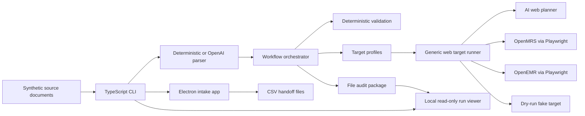

# Agentic UI Automation

Pilot for repeatable, audited UI data entry across web and desktop applications.

The workflow takes synthetic intake source documents, uses AI by default to
extract intake records, validates them deterministically, runs selected target
profiles through a generic web target runner, and writes a
traceable audit package for each run.

## Full E2E Commands

Run these from the repository root when you want the full Electron-to-OpenMRS
flow.

### Interactive Full Stack

Start the watcher, Electron intake app, and run viewer together:

```sh
npm run dev:all -- --agent openai
```

This keeps the handoff watcher, desktop app, and local audit viewer running in
one terminal with prefixed logs. The watcher forwards `--agent openai` to the
workflow CLI while target execution uses the generic web target runner.

### Unattended Full Stack

For unattended E2E runs, start the same services without an agent override:

```sh
npm run dev:all
```

Exception rows in the generated summaries include severity and remediation
steps; the local viewer color-codes error, warning, and info severities.

### Severity Demo

To generate a viewer-friendly severity demo with one error, one warning, and
one info row in the Top Issues table, run:

```sh
npm run dev -- run --input data/demo/intake-records-severity-levels.json --targets fake --runs-dir runs --parser deterministic
```

Expected result: `completed_with_exceptions`, `preflightExceptions: 1`, and
`targetCounts.fake.succeeded: 1`. Open the run in `npm run viewer` to inspect
the color-coded severity rows and remediation steps.

### Individual Services

The individual commands remain available when you want to debug one service at a
time:

```sh
npm run watch:intake
npm run desktop:dev
npm run viewer
```

### Electron Export Via Computer Use

With the Electron app already visible, drive the patient creation/export flow
from this interactive Codex chat:

```text
Use Computer Use against the existing Electron Intake Queue window to create one synthetic patient, clear existing selected seed records, select only the new patient, and export it.
```

The Computer Use step should run in the interactive Codex session, not through a
nested noninteractive `codex exec` command. The interactive session can approve
and hold app access for the visible Electron window, click through `New Patient`,
clear the default selected seed records, select only the created patient, and
export one `.ready.csv` handoff file. If the watcher is running, it picks up the
exported handoff and continues into OpenMRS.

## Contents

- [Full E2E Commands](#full-e2e-commands)
  - [Interactive Full Stack](#interactive-full-stack)
  - [Unattended Full Stack](#unattended-full-stack)
  - [Severity Demo](#severity-demo)
  - [Individual Services](#individual-services)
  - [Electron Export Via Computer Use](#electron-export-via-computer-use)
- [What It Demonstrates](#what-it-demonstrates)
- [Current Status](#current-status)
- [Architecture](#architecture)
- [Data Flow](#data-flow)
- [OpenAI API Touchpoints](#openai-api-touchpoints)
- [Quick Start](#quick-start)
- [Desktop Intake App](#desktop-intake-app)
- [Handoff Watcher](#handoff-watcher)
- [Destination Flexibility Demo](#destination-flexibility-demo)
- [OpenMRS Smoke](#openmrs-smoke)
- [OpenEMR Smoke](#openemr-smoke)
- [Audit Artifacts](#audit-artifacts)
- [Run Viewer](#run-viewer)
- [CLI](#cli)
- [Development](#development)
- [Project Layout](#project-layout)
- [Keeping This Current](#keeping-this-current)

## What It Demonstrates

- Last-mile UI automation when an API is unavailable or incomplete.
- AI-assisted parsing for variable source documents before deterministic
  validation and EMR entry.
- Deterministic orchestration around agentic screen interpretation.
- Structured exception handling instead of silent target failures.
- Audit evidence for every run: screenshots, event logs, normalized input,
  exception JSON, run metadata, a Markdown summary, and structured report JSON.
- Target profiles for audited EMR entry:
  - Web app: OpenMRS through Playwright.
  - Web app: OpenEMR through Playwright.
  - Fake target: deterministic local smoke target for orchestration and audit.

Use only synthetic data with this repository. The checked-in records under
`data/demo/` are intentionally synthetic.

## Current Status

- Core workflow: implemented and covered by tests.
- Fake target: deterministic local smoke target for orchestration and audit.
- OpenMRS web target: adapter and tests are implemented; live smoke requires a
  reachable synthetic/demo OpenMRS instance and current credentials.
- OpenEMR web target: adapter and tests are implemented; live smoke requires a
  reachable synthetic/demo OpenEMR instance and current credentials.
- Desktop intake app: Electron shell opens with seeded synthetic records,
  supports optional import, and exports CSV handoff files.
- Handoff watcher: separate CLI command processes exported files and runs the
  existing audited workflow.

## Architecture

The workflow is a TypeScript CLI that turns synthetic intake source documents
into audited UI data-entry runs. It uses OpenAI for optional source parsing and
target planning, deterministic TypeScript validation for safety gates,
Playwright for browser-based EMR automation, Electron for the local intake queue
and CSV handoff app, and a local read-only run viewer for audit review.

| Layer | Technology | Role |
| --- | --- | --- |
| Runtime and CLI | ![Node.js][node-badge] ![TypeScript][typescript-badge] | Runs the CLI, orchestrator, target profiles, target runner, and audit writers. |
| AI parsing and planning | ![OpenAI][openai-badge] | Extracts variable intake documents and can plan bounded UI actions. |
| Validation contract | ![Zod][zod-badge] | Defines schemas for CLI config, records, planner actions, and target results. |
| Web targets | ![Playwright][playwright-badge] ![OpenMRS][openmrs-badge] | Automates synthetic patient entry in browser-based OpenMRS and OpenEMR demo environments. |
| Desktop intake app | ![Electron][electron-badge] | Reviews seeded or imported synthetic intake records and exports CSV handoff files. |
| Run viewer | ![Node.js][node-badge] HTTP server | Serves a local read-only browser UI for generated run summaries and linked audit artifacts. |
| Audit and verification | ![JSON][json-badge] ![Markdown][markdown-badge] ![Vitest][vitest-badge] | Writes run artifacts, reports, event logs, screenshots, and test coverage. |

[node-badge]: https://img.shields.io/badge/Node.js-5FA04E?logo=nodedotjs&logoColor=white
[typescript-badge]: https://img.shields.io/badge/TypeScript-3178C6?logo=typescript&logoColor=white
[openai-badge]: https://img.shields.io/badge/OpenAI-412991?logo=openai&logoColor=white
[zod-badge]: https://img.shields.io/badge/Zod-3E67B1?logo=zod&logoColor=white
[playwright-badge]: https://img.shields.io/badge/Playwright-2EAD33?logo=playwright&logoColor=white
[openmrs-badge]: https://img.shields.io/badge/OpenMRS-005A70
[electron-badge]: https://img.shields.io/badge/Electron-47848F?logo=electron&logoColor=white
[json-badge]: https://img.shields.io/badge/JSON-000000?logo=json&logoColor=white
[markdown-badge]: https://img.shields.io/badge/Markdown-000000?logo=markdown&logoColor=white
[vitest-badge]: https://img.shields.io/badge/Vitest-6E9F18?logo=vitest&logoColor=white



## Data Flow


The data flow converts source documents into raw intake records, applies
deterministic validation before target entry, records all successful and
exceptional paths, and finishes with the audit contract under `runs/<run-id>/`.
The viewer reads those files after or during a run for local review; it does not
write records, invoke target runners, or mutate audit artifacts.

## OpenAI API Touchpoints

The workflow has two OpenAI API integration points. Both use the OpenAI
Responses API through the `openai` Node SDK and require `OPENAI_API_KEY` when
enabled.

1. Source parsing: `src/parsing/aiIntakeParser.ts` calls OpenAI when
   `--parser openai` is used. This is the default for direct `run` commands and
   extracts structured intake records, confidence scores, and source evidence
   from JSON, CSV, TXT, PDF, or DOCX text-bearing inputs. Use
   `--parser deterministic` with normalized fixtures when a run should not call
   OpenAI.
2. AI web planner: `src/targets/aiWebPlanner.ts` calls OpenAI for non-fake
   target profiles. The planner receives the target profile, normalized record,
   page observation, completed and skipped fields, success criteria, forbidden
   actions, and step count, then returns one schema-validated bounded browser
   action.

The Electron intake app also uses the source parser for imported PDF and DOCX
files because those formats need text extraction before they can enter the
normalized queue. JSON, CSV, and TXT imports use deterministic loading.

## Quick Start

Install dependencies:

```sh
npm install
```

Run the no-UI demo first:

```sh
npm run dev -- run --input data/demo/intake-records-severity-levels.json --targets fake --runs-dir runs --parser deterministic
```

Expected result:

- `status` is `completed_with_exceptions`.
- `preflightExceptions` is `1`.
- `targetCounts.fake.succeeded` is `1`.

The status includes exceptions because the demo file contains an intentionally
invalid record that should stop during validation.

## Desktop Intake App

The desktop app is a synthetic intake queue. It opens with
`data/demo/intake-seed-records.json`, which includes complete records, missing
required fields, malformed contact data, ambiguous insurance, address variation,
and low-confidence extraction examples. The app also has an optional import flow
for synthetic JSON, CSV, TXT, PDF, or DOCX sources, and a `New Patient` flow for
creating a synthetic intake record directly in the queue.

Run the app:

```sh
npm run desktop:dev
```

Export writes selected export-ready records to:

```text
~/Downloads/agentic-ui-intake/*.ready.csv
```

The CSV is meant to be easy to inspect in a spreadsheet app. The app does not run
OpenMRS automation directly.

### Full Electron To OpenMRS E2E

Use this flow when you want the full desktop handoff path: Electron exports
synthetic intake records, then the watcher picks up the handoff file and runs
the OpenMRS target end to end.

Run this command from the repository root to start the handoff watcher, Electron
intake app, and local audit viewer together:

```sh
npm run dev:all -- --agent openai
```

For debugging, each long-running service can still be launched separately:

```sh
npm run watch:intake
npm run desktop:dev
npm run viewer
```

With the Electron app already running and visible, ask this interactive Codex
chat to automate the patient creation and export steps through Computer Use:

```text
Use Computer Use against the existing Electron Intake Queue window to create one synthetic patient, clear existing selected seed records, select only the new patient, and export it.
```

For manual use, click `New Patient`, review or edit the generated synthetic
intake fields, add the patient to the queue, keep the created record selected,
and click `Export Selected`. For Computer Use, keep `npm run dev:all` or
`npm run desktop:dev` running and leave the Intake Queue window visible. The
agent should clear the
default selected seed records, create one synthetic patient through the
`New Patient` form, select only that created patient, export it, and leave the
app running. This uses the visible app like a third-party desktop app and does
not use Playwright, IPC, preload APIs, `window.intakeApp`, or other app
internals. In both cases, the watcher processes
`~/Downloads/agentic-ui-intake/*.ready.csv`, moves the file to
`processed/<runId>.csv` after completion, and writes the OpenMRS audit package
under `runs/<run-id>/`.

## Handoff Watcher

Start the watcher separately when exported intake files should run through the
workflow:

```sh
set -a
. ./.env
set +a
npm run dev -- watch \
  --inbox ~/Downloads/agentic-ui-intake \
  --targets openmrs \
  --runs-dir runs \
  --synthetic-suffix auto
```

The watcher accepts `.ready.csv` and `.ready.json` handoff files. It moves files
through `processing/`, then to `processed/<runId>.csv` or
`processed/<runId>.json` based on the source format, or to `failed/`, and writes
the normal audit package under `runs/<run-id>/`.

For a one-shot local check with the fake target:

```sh
npm run dev -- watch --once --inbox ~/Downloads/agentic-ui-intake --targets fake --runs-dir runs
```

## Destination Flexibility Demo

Use the same synthetic source file and change only the destination target. The
first command runs OpenMRS:

```sh
set -a
. ./.env
set +a
npm run dev -- run \
  --input data/demo/intake-records.json \
  --targets openmrs \
  --runs-dir runs \
  --synthetic-suffix auto
```

The second command runs OpenEMR with the same intake file and the same
non-target workflow options:

```sh
set -a
. ./.env
set +a
npm run dev -- run \
  --input data/demo/intake-records.json \
  --targets openemr \
  --runs-dir runs \
  --synthetic-suffix auto
```

Both runs use the same parser, deterministic validation, normalized record
schema, orchestrator, audit artifacts, and viewer. The intentional difference is
`--targets openmrs` versus `--targets openemr`.

Run `npm run viewer` afterward. The viewer sidebar run names, each
`executive-summary.md`, and each `summary.md` identify the destination target,
for example `OpenMRS` or `OpenEMR`, so the two runs are easy to compare.

## OpenMRS Smoke

Prerequisites:

- Playwright Chromium is installed.
- The default OpenMRS demo settings are acceptable, or `OPENMRS_BASE_URL`,
  `OPENMRS_USERNAME`, and `OPENMRS_PASSWORD` point to another synthetic/demo
  OpenMRS environment.
- `.env` contains `OPENAI_API_KEY` when using the default OpenAI parser or a
  non-fake target profile.

Install Chromium if needed:

```sh
npx playwright install chromium
```

OpenMRS publishes current demo links at `https://openmrs.org/demo/`. This
adapter uses the OpenMRS 2 Reference Application because the workflow is a
patient registration smoke and O2 exposes a stable registration wizard.

- Demo page: `https://openmrs.org/demo/`
- Default app URL: `https://o2.openmrs.org/openmrs`
- Default username: `admin`
- Default password: `Admin123`
- Default location: `Registration Desk`
- Default OpenMRS record concurrency: `2`

The defaults are built into the CLI. Populate `.env` only when overriding them,
using the OpenAI parser, or running a non-fake target profile:

```dotenv
OPENMRS_BASE_URL=https://o2.openmrs.org/openmrs
OPENMRS_USERNAME=admin
OPENMRS_PASSWORD=Admin123
OPENMRS_CONCURRENCY=2
OPENAI_API_KEY=<your-api-key>
```

Run against the configured OpenMRS environment with the default OpenAI source
parser:

```sh
set -a
. ./.env
set +a
npm run dev -- run \
  --input data/demo/intake-records.json \
  --targets openmrs \
  --runs-dir runs \
  --synthetic-suffix auto \
  --openmrs-concurrency 2
```

`data/demo/intake-records.json` intentionally uses varied source shapes and
field labels so the demo exercises AI source parsing before deterministic EMR
entry.

For local smoke checks that should not call OpenAI, use
`data/demo/intake-records-normalized.json` and add `--parser deterministic`.

Public demo credentials and screens can change. If login, navigation, selectors,
or save behavior drift, the run should finish with auditable environment or
UI-state exceptions rather than silently claiming success.

OpenMRS can expose patient deletion when `Admin` -> `Config` -> `Features` ->
`Allow Administrators to Delete Patients` is enabled. The current public demo has
that setting off, and enabling it would mutate shared demo configuration. The
smoke run therefore uses `--synthetic-suffix auto` to create fresh synthetic
patient names and identifiers instead of deleting prior demo patients.

### What The OpenMRS Target Does

For each normalized valid source record, the OpenMRS adapter is expected to:

1. Log in to the configured OpenMRS environment.
1. Capture a `before-navigation` screenshot.
1. Open the O2 `Register a patient` app.
1. When interactive field confirmation is enabled, prompt the operator in the
   OpenMRS browser before writing values whose field mapping confidence is below
   the configured threshold.
1. Fill the registration wizard with demographics and available contact fields.
1. Capture an `after-fill` screenshot.
1. Advance to the confirmation step and click `Confirm`.
1. Treat similar-patient prompts as duplicate exceptions for manual review.
1. Wait for the newly created patient's dashboard.
1. Expand `Show Contact Info` when available so address and phone are visible.
1. Capture an `after-save` proof screenshot from that dashboard.
1. Treat the record as successful only if the dashboard shows the synthetic
    patient name and patient-detail context.

For the checked-in demo file, four records are valid and three records are
intentionally invalid and stop in preflight validation. One valid record is
deliberately written with uncertain source wording so source extraction metadata
includes lower-confidence examples. A clean OpenMRS target pass therefore means:

- `preflightExceptions` is `3`.
- `targetCounts.openmrs.succeeded` is `4`.
- `targetCounts.openmrs.exception` is `0`.
- `exceptions/` only contains the three intentional validation exceptions.
- Each valid record has `before-navigation`, `after-fill`, and an `after-save`
  proof screenshot from the patient dashboard with contact info expanded when
  OpenMRS exposes it.
- `executive-summary.md` gives a quick run outcome, while `summary.md` includes
  an OpenMRS record review with raw intake input, patient-dashboard proof
  screenshots, per-field mapping confidence, and source-to-OpenMRS comparisons.
  Issue sections categorize exceptions by severity and include remediation
  guidance for manual review.
  On public demo layouts, optional contact fields that are unavailable may
  appear as failed mappings without causing a target exception.

Manual verification:

1. Copy the `runId` from the CLI output and inspect the run summary:

   ```sh
   RUN_ID="<run-id-from-cli-output>"
   cat "runs/$RUN_ID/executive-summary.md"
   cat "runs/$RUN_ID/summary.md"
   cat "runs/$RUN_ID/run.json"
   cat "runs/$RUN_ID/input/normalized-records.json"
   ```

2. Note the generated `lastName`, `email`, `phone`, and `insuranceMemberId`
   values in `normalized-records.json`. With `--synthetic-suffix auto`, the
   valid demo patients are renamed to values like `Nguyen Run-...`,
   `Lee Run-...`, and `Shah Run-...`.
3. Confirm the OpenMRS screenshot sequence exists for each valid record:

   ```sh
   find "runs/$RUN_ID/screenshots" -path "*/openmrs/*.png" | sort
   ```

4. Open each `*-after-save.png` screenshot and confirm it shows the newly
   created patient's dashboard with the generated synthetic patient name.
5. Log in to the same OpenMRS environment used by the run.
6. Open the patient search or finder screen.
7. Search for the four generated last names from `normalized-records.json`.
8. Open each patient record and confirm the demographic and contact fields match
   `normalized-records.json` for the fields present in that demo layout. Use the
   OpenMRS record review in `summary.md` to see source values, mapping
   confidence, selectors, and which optional fields were unavailable.
9. Confirm the audit log includes an `after-save` event for each valid record:

   ```sh
   grep "after-save" "runs/$RUN_ID/events.jsonl"
   ```

The public OpenMRS demo keeps data for a while. If you run without
`--synthetic-suffix`, existing demo patients may cause duplicate or verification
exceptions. Use `--synthetic-suffix auto` when you need a clean end-to-end
OpenMRS success run.

## OpenEMR Smoke

The OpenEMR target drives the configured OpenEMR web UI through Chromium and
writes the same audit artifact set as the OpenMRS target. Public demo screens
and credentials can change, so verify the current OpenEMR demo page before
assuming a selector failure is an adapter defect.

- Demo page: `https://www.open-emr.org/demo/`
- Default app URL: `https://demo.openemr.io/openemr`
- Default username: `admin`
- Default password: `pass`
- Default OpenEMR record concurrency: `1`

Optional `.env` overrides:

```dotenv
OPENEMR_BASE_URL=https://demo.openemr.io/openemr
OPENEMR_USERNAME=admin
OPENEMR_PASSWORD=pass
OPENEMR_CONCURRENCY=1
```

Run against the configured OpenEMR environment:

```sh
set -a
. ./.env
set +a
npm run dev -- run \
  --input data/demo/intake-records.json \
  --targets openemr \
  --runs-dir runs \
  --synthetic-suffix auto \
  --openemr-concurrency 1
```

The OpenEMR adapter opens the demographics workflow, fills visible demographic
and contact fields from the normalized intake record, captures
`before-navigation`, `after-fill`, and `after-save` screenshots, and records
OpenEMR field mappings in `summary.md` and `report.json`. Fields that are not
available in the selected OpenEMR screen are reported as field mapping evidence
or target exceptions depending on whether they are required for patient
creation.

## Audit Artifacts

Each run writes to `runs/<run-id>/`:

```text
run.json
executive-summary.md
summary.md
report.json
events.jsonl
input/normalized-records.json
exceptions/*.json
screenshots/<record-id>/<target>/<capture-order>-<step>.png
```

Use the `runId` from CLI output to inspect a specific run:

```sh
RUN_ID="<run-id-from-cli-output>"
cat "runs/$RUN_ID/executive-summary.md"
cat "runs/$RUN_ID/summary.md"
cat "runs/$RUN_ID/report.json"
cat "runs/$RUN_ID/run.json"
tail -n 40 "runs/$RUN_ID/events.jsonl"
find "runs/$RUN_ID/exceptions" -maxdepth 1 -type f -print -exec cat {} \;
find "runs/$RUN_ID/screenshots" -type f | sort
```

The screenshot tree is nested by record and target. Screenshot filenames are
prefixed with capture order, such as `0001-before-navigation.png`, so sorted
directory listings show what the workflow saw in the order it saw it.

## Run Viewer

Start the local read-only viewer when you want to inspect generated Markdown
summaries and linked artifacts in a browser:

```sh
npm run viewer
```

The viewer serves `runs/` by default at `http://127.0.0.1:4173`. Use a different
runs directory or port when needed:

```sh
npm run viewer -- --runs-dir runs --port 4555
```

The app lists run folders newest-first, renders `executive-summary.md` and
`summary.md`, and resolves run-relative links so screenshot evidence opens from
the browser. Issue tables include severity, remediation, and evidence columns;
the viewer color-codes severity rows for faster triage. It also exposes raw
links for `report.json`, `events.jsonl`, `input/normalized-records.json`,
`exceptions/`, and `screenshots/` when those artifacts exist.

The viewer is local-only and read-only. It does not run automation, edit
records, delete patients, or modify audit artifacts.

## CLI

```sh
npm run dev -- run \
  --input <path-to-json-csv-text-pdf-or-docx-source> \
  --targets fake,openmrs,openemr \
  --runs-dir runs \
  --parser openai \
  --agent scripted \
  --synthetic-suffix auto \
  --openmrs-concurrency 2 \
  --openemr-concurrency 1
```

Serve the local artifact viewer:

```sh
npm run dev -- viewer --runs-dir runs --port 4173
```

Options:

- `--input`: required source file. AI parsing supports JSON, CSV, TXT, PDF, and
  DOCX text-bearing inputs.
- `--targets`: comma-separated targets: `fake`, `openmrs`, `openemr`.
- `--runs-dir`: audit output directory. Defaults to `runs`.
- `--parser`: `openai` or `deterministic`. Defaults to `openai`; use
  `deterministic` for local fixture/smoke runs that should not call OpenAI.
- `--parser-model`: OpenAI model for source parsing. Defaults to
  `OPENAI_PARSER_MODEL`, then `OPENAI_MODEL`, then `gpt-5.4-mini`.
- `--agent`: `scripted` or `openai`. Defaults to `scripted`.
- `--synthetic-suffix`: appends a suffix to valid synthetic records before
  validation and target entry. Use `auto` for public EMR demo runs so each run
  uses fresh patient names and identifiers.
- `--openmrs-concurrency`: maximum number of OpenMRS records to enter at the
  same time. Defaults to `OPENMRS_CONCURRENCY`, then `2`.
- `--openemr-concurrency`: maximum number of OpenEMR records to enter at the
  same time. Defaults to `OPENEMR_CONCURRENCY`, then `1`.

Environment variables:

- `OPENMRS_BASE_URL`
- `OPENMRS_USERNAME`
- `OPENMRS_PASSWORD`
- `OPENMRS_CONCURRENCY`
- `OPENEMR_BASE_URL`
- `OPENEMR_USERNAME`
- `OPENEMR_PASSWORD`
- `OPENEMR_CONCURRENCY`
- `RUNS_DIR`
- `OPENAI_API_KEY`
- `OPENAI_PARSER_MODEL`
- `OPENAI_MODEL`

See `.env.example` for the full list.

### Watch Command

```sh
npm run dev -- watch \
  --inbox ~/Downloads/agentic-ui-intake \
  --targets openmrs \
  --runs-dir runs \
  --synthetic-suffix auto \
  --openmrs-concurrency 2
```

Options:

- `--inbox`: folder containing exported `*.ready.csv` or `*.ready.json` files.
  Defaults to `~/Downloads/agentic-ui-intake`.
- `--targets`: comma-separated target profiles. Defaults to `openmrs`.
- `--runs-dir`, `--agent`, `--synthetic-suffix`, `--openmrs-concurrency`, and
  `--openemr-concurrency`: same meaning as `run`.
- `--once`: process currently ready files once and exit.

## Development

Run verification:

```sh
npm run typecheck
npm test
```

Build:

```sh
npm run build
```

Run the desktop app:

```sh
npm run desktop:dev
```

Run the full local E2E service stack:

```sh
npm run dev:all -- --agent openai
```

This starts `watch:intake`, the Electron app, and the viewer. `dev:all` only
forwards the optional `--agent` flag to the watcher.

Packaging dry run:

```sh
npm pack --dry-run
```

## Project Layout

```text
src/domain/        Intake schemas and validation
src/parsing/       Deterministic loading plus AI source-document parsing
src/orchestrator/  Workflow coordination and exception handling
src/audit/         Run metadata, events, summaries, screenshots, exceptions
src/agent/         Legacy scripted and OpenAI-backed agent drivers
src/adapters/      Legacy target adapter contract and fake adapter
src/desktop/       Electron intake app and seeded/imported queue service
src/handoff/       CSV/JSON handoff file writer
src/watcher/       Separate handoff watcher and workflow launcher
src/viewer/        Local read-only HTTP viewer for run summaries and artifacts
src/targets/       Target profiles, generic web runner, and legacy EMR adapters
tests/             Unit and integration-style coverage
docs/demo.md       Longer smoke-demo walkthrough
```

## Keeping This Current

When behavior, commands, targets, audit paths, or prerequisites change, update
this README and `docs/demo.md` in the same change. After edits, run
`npm run typecheck` and `npm test` before treating the repo as current.
