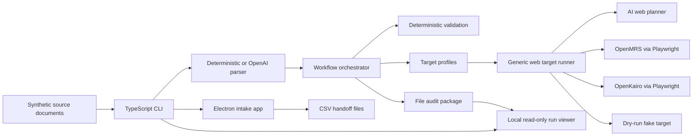
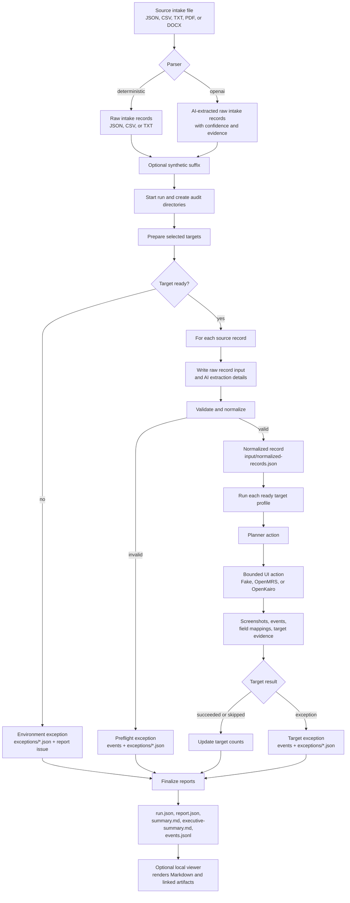

# Agentic UI Automation

Pilot for repeatable, audited UI data entry across web and desktop applications.

The workflow takes synthetic intake source documents, uses AI by default to
extract intake records, validates them deterministically, runs selected target
profiles through a generic web target runner, and writes a
traceable audit package for each run.

## Full E2E Commands

Run these from the repository root for the full E2E demo. Each command starts
the handoff watcher, Electron intake app, and local run viewer. Use
`--intake-trigger watcher` when the watcher should wait for Electron to export a
`.ready.csv` or `.ready.json` file into `~/Downloads/agentic-ui-intake`. Use
`--intake-trigger auto-import` when the command should also drop
`data/demo/intake-records-normalized.json` into that inbox as a ready handoff.
The target commands are otherwise identical except for the destination web app
in `--targets`.

### OpenMRS Target

Uses the official OpenMRS 2 Reference Application demo by default:
`https://o2.openmrs.org/openmrs/login.htm`.

Interactive watcher-triggered:

```sh
set -a
. ./.env
set +a
npm run dev:all -- --targets openmrs --intake-trigger watcher --confidence-threshold .99
```

Unattended auto-import demo JSON:

```sh
set -a
. ./.env
set +a
npm run dev:all -- --targets openmrs --intake-trigger auto-import --confidence-threshold .99
```

### OpenKairo Target

Interactive watcher-triggered:

```sh
set -a
. ./.env
set +a
npm run dev:all -- --targets openkairo --intake-trigger watcher --confidence-threshold .99
```

Unattended auto-import demo JSON:

```sh
set -a
. ./.env
set +a
npm run dev:all -- --targets openkairo --intake-trigger auto-import --confidence-threshold .99
```

### Both Targets Simultaneously

Interactive watcher-triggered:

```sh
set -a
. ./.env
set +a
npm run dev:all -- --targets openmrs,openkairo --intake-trigger watcher --confidence-threshold .99
```

Unattended auto-import demo JSON:

```sh
set -a
. ./.env
set +a
npm run dev:all -- --targets openmrs,openkairo --intake-trigger auto-import --confidence-threshold .99
```

Click `Export Selected`, or use the Computer Use prompt below, to create the
handoff file in watcher-triggered mode. Auto-import mode creates that handoff
from the checked-in demo JSON after the services start. The watcher applies a
unique synthetic suffix by default, so repeated demo exports create fresh
synthetic patient identifiers. Interactive and unattended use the same commands;
the difference is whether you watch the browser while the triggered run is
active.

The viewer starts with the stack at `http://127.0.0.1:4173` by default and
prints its URL in the `[viewer]` log line. Use `--viewer-port 0` only when you
want the OS to choose a random available port. Its sidebar run name,
`executive-summary.md`, and `summary.md` identify the destination target for
each run.

Exception rows in the generated summaries include severity and remediation
steps; the local viewer color-codes error, warning, and info severities.

### Severity Demo

To generate a viewer-friendly severity demo with one error, one warning, and
one info row in the Top Issues table, run:

```sh
npm run dev -- run --input data/demo/intake-records-severity-levels.json --targets fake --runs-dir runs --parser deterministic
```

Expected result: `completed_with_exceptions`, `preflightExceptions: 1`, and
`targetCounts.fake.succeeded: 1`. Open the run in `npm run viewer` to inspect
the color-coded severity rows and remediation steps.

### Individual Services

The individual commands remain available when you want to debug one service at a
time:

```sh
npm run watch:intake
npm run desktop:dev
npm run viewer
```

### Electron Export Via Computer Use

With the Electron app already visible, drive the patient creation/export flow
from this interactive Codex chat:

```text
Use Computer Use against the existing Electron Intake Queue window to create one synthetic patient, clear existing selected seed records, select only the new patient, and export it.
```

The Computer Use step should run in the interactive Codex session, not through a
nested noninteractive `codex exec` command. The interactive session can approve
and hold app access for the visible Electron window, click through `New Patient`,
clear the default selected seed records, select only the created patient, and
export one `.ready.csv` handoff file. If the watcher is running, it picks up the
exported handoff and continues into OpenMRS.

## Contents

- [Full E2E Commands](#full-e2e-commands)
  - [OpenMRS Target](#openmrs-target)
  - [OpenKairo Target](#openkairo-target)
  - [Both Targets Simultaneously](#both-targets-simultaneously)
  - [Severity Demo](#severity-demo)
  - [Individual Services](#individual-services)
  - [Electron Export Via Computer Use](#electron-export-via-computer-use)
- [What It Demonstrates](#what-it-demonstrates)
- [Current Status](#current-status)
- [Architecture](#architecture)
- [Data Flow](#data-flow)
- [OpenAI API Touchpoints](#openai-api-touchpoints)
- [Quick Start](#quick-start)
- [Desktop Intake App](#desktop-intake-app)
- [Handoff Watcher](#handoff-watcher)
- [Destination Flexibility Demo](#destination-flexibility-demo)
- [OpenMRS Smoke](#openmrs-smoke)
- [OpenKairo Smoke](#openkairo-smoke)
- [Audit Artifacts](#audit-artifacts)
- [Run Viewer](#run-viewer)
- [CLI](#cli)
- [Development](#development)
- [Project Layout](#project-layout)
- [Keeping This Current](#keeping-this-current)

## What It Demonstrates

- Last-mile UI automation when an API is unavailable or incomplete.
- AI-assisted parsing for variable source documents before deterministic
  validation and EMR entry.
- Deterministic orchestration around agentic screen interpretation.
- Structured exception handling instead of silent target failures.
- Audit evidence for every run: screenshots, event logs, normalized input,
  exception JSON, run metadata, a Markdown summary, and structured report JSON.
- Target profiles for audited EMR entry:
  - Web app: OpenMRS through Playwright.
  - Web app: OpenKairo through Playwright.
  - Fake target: deterministic local smoke target for orchestration and audit.

Use only synthetic data with this repository. The checked-in records under
`data/demo/` are intentionally synthetic.

## Current Status

- Core workflow: implemented and covered by tests.
- Fake target: deterministic local smoke target for orchestration and audit.
- OpenMRS web target profile: implemented through the generic AI web target
  runner; live smoke requires a reachable synthetic/demo OpenMRS instance,
  current credentials, and `OPENAI_API_KEY`.
- OpenKairo web target profile: implemented through the generic AI web target
  runner; live smoke requires the reachable synthetic/demo OpenKairo instance,
  current credentials, and `OPENAI_API_KEY`.
- Desktop intake app: Electron shell opens with seeded synthetic records,
  supports optional import, and exports CSV handoff files.
- Handoff watcher: separate CLI command processes exported files and runs the
  existing audited workflow.

## Architecture

The workflow is a TypeScript CLI that turns synthetic intake source documents
into audited UI data-entry runs. It uses OpenAI for optional source parsing and
target planning, deterministic TypeScript validation for safety gates,
Playwright for browser-based EMR automation, Electron for the local intake queue
and CSV handoff app, and a local read-only run viewer for audit review.

| Layer | Technology | Role |
| --- | --- | --- |
| Runtime and CLI | ![Node.js][node-badge] ![TypeScript][typescript-badge] | Runs the CLI, orchestrator, target profiles, target runner, and audit writers. |
| AI parsing and planning | ![OpenAI][openai-badge] | Extracts variable intake documents and can plan bounded UI actions. |
| Validation contract | ![Zod][zod-badge] | Defines schemas for CLI config, records, planner actions, and target results. |
| Web targets | ![Playwright][playwright-badge] ![OpenMRS][openmrs-badge] | Automates synthetic patient entry in browser-based OpenMRS and OpenKairo demo environments. |
| Desktop intake app | ![Electron][electron-badge] | Reviews seeded or imported synthetic intake records and exports CSV handoff files. |
| Run viewer | ![Node.js][node-badge] HTTP server | Serves a local read-only browser UI for generated run summaries and linked audit artifacts. |
| Audit and verification | ![JSON][json-badge] ![Markdown][markdown-badge] ![Vitest][vitest-badge] | Writes run artifacts, reports, event logs, screenshots, and test coverage. |

[node-badge]: https://img.shields.io/badge/Node.js-5FA04E?logo=nodedotjs&logoColor=white
[typescript-badge]: https://img.shields.io/badge/TypeScript-3178C6?logo=typescript&logoColor=white
[openai-badge]: https://img.shields.io/badge/OpenAI-412991?logo=openai&logoColor=white
[zod-badge]: https://img.shields.io/badge/Zod-3E67B1?logo=zod&logoColor=white
[playwright-badge]: https://img.shields.io/badge/Playwright-2EAD33?logo=playwright&logoColor=white
[openmrs-badge]: https://img.shields.io/badge/OpenMRS-005A70
[electron-badge]: https://img.shields.io/badge/Electron-47848F?logo=electron&logoColor=white
[json-badge]: https://img.shields.io/badge/JSON-000000?logo=json&logoColor=white
[markdown-badge]: https://img.shields.io/badge/Markdown-000000?logo=markdown&logoColor=white
[vitest-badge]: https://img.shields.io/badge/Vitest-6E9F18?logo=vitest&logoColor=white



## Data Flow



The data flow converts source documents into raw intake records, applies
deterministic validation before target entry, records all successful and
exceptional paths, and finishes with the audit contract under `runs/<run-id>/`.
The viewer reads those files after or during a run for local review; it does not
write records, invoke target runners, or mutate audit artifacts.

## OpenAI API Touchpoints

The workflow has two OpenAI API integration points. Both use the OpenAI
Responses API through the `openai` Node SDK and require `OPENAI_API_KEY` when
enabled.

1. Source parsing: `src/parsing/aiIntakeParser.ts` calls OpenAI when
   `--parser openai` is used. This is the default for direct `run` commands and
   extracts structured intake records, confidence scores, and source evidence
   from JSON, CSV, TXT, PDF, or DOCX text-bearing inputs. Use
   `--parser deterministic` with normalized fixtures when a run should not call
   OpenAI.
2. AI web planner: `src/targets/aiWebPlanner.ts` calls OpenAI for non-fake
   target profiles. The planner receives the target profile, normalized record,
   page observation, completed and skipped fields, success criteria, forbidden
   actions, and step count, then returns one schema-validated bounded browser
   action.

The target runner calls the AI web planner once per browser step, not once per
record. Each loop observes the current page, asks for one bounded action, runs
that action, captures evidence, and repeats with a fresh observation. As a
result, each filled or selected field in OpenMRS O2 or OpenKairo normally has
its own planner call, rationale, confidence score, field mapping, and
`ai-field-*` screenshot. Clicks, waits, screenshots, and verification attempts
are also separate planner-driven steps. This is deliberate: the planner sees the
actual UI state after every action instead of relying on a precomputed script.

The non-fake target loop is:

1. Observe page state: URL, visible text, controls, and screenshot.
1. Send that observation, normalized record, target profile, completed fields,
   skipped fields, recent actions, and step count to the AI planner.
1. Receive exactly one schema-bound action from the planner.
1. Execute that one action in the browser.
1. Repeat with a fresh page observation.

The Electron intake app also uses the source parser for imported PDF and DOCX
files because those formats need text extraction before they can enter the
normalized queue. JSON, CSV, and TXT imports use deterministic loading.

The workflow does not call OpenAI for deterministic fixture parsing, fake-target
smoke runs, deterministic validation, audit report generation, Markdown
rendering, local viewer display, file watching, or Electron queue operations
other than source parsing for imported text-bearing documents.

## Quick Start

Install dependencies:

```sh
npm install
```

Run the no-UI demo first:

```sh
npm run dev -- run --input data/demo/intake-records-severity-levels.json --targets fake --runs-dir runs --parser deterministic
```

Expected result:

- `status` is `completed_with_exceptions`.
- `preflightExceptions` is `1`.
- `targetCounts.fake.succeeded` is `1`.

The status includes exceptions because the demo file contains an intentionally
invalid record that should stop during validation.

## Desktop Intake App

The desktop app is a synthetic intake queue. It opens with
`data/demo/intake-seed-records.json`, which includes complete records, missing
required fields, malformed contact data, ambiguous insurance, address variation,
and low-confidence extraction examples. The app also has an optional import flow
for synthetic JSON, CSV, TXT, PDF, or DOCX sources, and a `New Patient` flow for
creating a synthetic intake record directly in the queue.

Run the app:

```sh
npm run desktop:dev
```

Export writes selected export-ready records to:

```text
~/Downloads/agentic-ui-intake/*.ready.csv
```

The CSV is meant to be easy to inspect in a spreadsheet app. The app does not run
OpenMRS automation directly.

### Full Electron To OpenMRS E2E

Use this flow when you want the full desktop handoff path: Electron exports
synthetic intake records, then the watcher picks up the handoff file and runs
the OpenMRS target end to end.

Run this command from the repository root to start the handoff watcher, Electron
intake app, and local audit viewer together:

```sh
npm run dev:all -- --targets openmrs --intake-trigger watcher
```

For debugging, each long-running service can still be launched separately:

```sh
npm run watch:intake
npm run desktop:dev
npm run viewer
```

With the Electron app already running and visible, ask this interactive Codex
chat to automate the patient creation and export steps through Computer Use:

```text
Use Computer Use against the existing Electron Intake Queue window to create one synthetic patient, clear existing selected seed records, select only the new patient, and export it.
```

For manual use, click `New Patient`, review or edit the generated synthetic
intake fields, add the patient to the queue, keep the created record selected,
and click `Export Selected`. For Computer Use, keep
`npm run dev:all -- --targets openmrs --intake-trigger watcher` or
`npm run desktop:dev` running and leave the Intake Queue window visible. The
agent should clear the
default selected seed records, create one synthetic patient through the
`New Patient` form, select only that created patient, export it, and leave the
app running. This uses the visible app like a third-party desktop app and does
not use Playwright, IPC, preload APIs, `window.intakeApp`, or other app
internals. In both cases, the watcher processes
`~/Downloads/agentic-ui-intake/*.ready.csv`, moves the file to
`processed/<runId>.csv` after completion, and writes the OpenMRS audit package
under `runs/<run-id>/`.

## Handoff Watcher

Start the watcher separately when exported intake files should run through the
workflow:

```sh
set -a
. ./.env
set +a
npm run dev -- watch \
  --inbox ~/Downloads/agentic-ui-intake \
  --targets openmrs \
  --runs-dir runs
```

The watcher accepts `.ready.csv` and `.ready.json` handoff files. It moves files
through `processing/`, then to `processed/<runId>.csv` or
`processed/<runId>.json` based on the source format, or to `failed/`, and writes
the normal audit package under `runs/<run-id>/`. Watcher runs default to
`--synthetic-suffix auto` so repeated exports create fresh synthetic patient
identifiers.

For a one-shot local check with the fake target:

```sh
npm run dev -- watch --once --inbox ~/Downloads/agentic-ui-intake --targets fake --runs-dir runs
```

## Destination Flexibility Demo

Use the same synthetic source file, parser, run directory, and synthetic suffix
strategy. The only command-line difference is the destination target.

OpenMRS target:

```sh
set -a
. ./.env
set +a
npm run dev -- run \
  --input data/demo/intake-records-normalized.json \
  --targets openmrs \
  --runs-dir runs \
  --parser deterministic \
  --synthetic-suffix auto
```

OpenKairo target:

```sh
set -a
. ./.env
set +a
npm run dev -- run \
  --input data/demo/intake-records-normalized.json \
  --targets openkairo \
  --runs-dir runs \
  --parser deterministic \
  --synthetic-suffix auto
```

These are the same commands for unattended runs and for interactive demos where
you watch the browser work. Both runs use the same parser, deterministic
validation, normalized record schema, orchestrator, audit artifacts, and viewer.
The intentional difference is `--targets openmrs` versus `--targets openkairo`.
OpenMRS and OpenKairo both use the same generic AI web target runner; target
profiles supply the URL, credentials, target name, goal, and proof criteria.
There are no destination-specific UI automation classes for those EMR screens.

Run `npm run viewer` afterward. The viewer sidebar run names, each
`executive-summary.md`, and each `summary.md` identify the destination target,
for example `OpenMRS` or `OpenKairo`, so the two runs are easy to compare.

## OpenMRS Smoke

Prerequisites:

- Playwright Chromium is installed.
- The default OpenMRS demo settings are acceptable, or `OPENMRS_BASE_URL`,
  `OPENMRS_USERNAME`, and `OPENMRS_PASSWORD` point to another synthetic/demo
  OpenMRS environment.
- `.env` contains `OPENAI_API_KEY` when using the default OpenAI parser or a
  non-fake target profile.

Install Chromium if needed:

```sh
npx playwright install chromium
```

OpenMRS publishes current demo links at `https://openmrs.org/demo/`. The
OpenMRS target profile points at the OpenMRS 2 Reference Application demo
because the current OpenMRS 3 public demo can render a blank SPA home page
before login.

- Demo page: `https://openmrs.org/demo/`
- Default app URL: `https://o2.openmrs.org/openmrs/login.htm`
- Default username: `admin`
- Default password: `Admin123`
- Default location: `Registration Desk`
- Default OpenMRS record concurrency: `1`

The defaults are built into the CLI. Populate `.env` only when overriding them,
using the OpenAI parser, or running a non-fake target profile:

```dotenv
OPENMRS_BASE_URL=https://o2.openmrs.org/openmrs/login.htm
OPENMRS_USERNAME=admin
OPENMRS_PASSWORD=Admin123
OPENMRS_CONCURRENCY=1
OPENAI_API_KEY=<your-api-key>
```

Run against the configured OpenMRS environment:

```sh
set -a
. ./.env
set +a
npm run dev -- run \
  --input data/demo/intake-records-normalized.json \
  --targets openmrs \
  --runs-dir runs \
  --parser deterministic \
  --synthetic-suffix auto
```

Use `data/demo/intake-records.json` without `--parser deterministic` when you
want to exercise AI source parsing before deterministic EMR entry.

Public demo credentials and screens can change. If login, navigation, page
structure, or save behavior drift, the run should finish with auditable
environment or UI-state exceptions rather than silently claiming success.

OpenMRS can expose patient deletion when `Admin` -> `Config` -> `Features` ->
`Allow Administrators to Delete Patients` is enabled. The current public demo has
that setting off, and enabling it would mutate shared demo configuration. The
smoke run therefore uses `--synthetic-suffix auto` to create fresh synthetic
patient names and identifiers instead of deleting prior demo patients.

### What The OpenMRS Target Profile Does

For each normalized valid source record, the generic AI web target runner uses
the OpenMRS target profile to:

1. Open the configured OpenMRS environment.
1. Observe the current page, visible text, URL, title, and available controls.
1. Ask the AI web planner for one schema-validated bounded browser action at a
   time, using the target profile, normalized record, completed and skipped
   fields, success criteria, forbidden actions, and step count.
1. Execute only supported browser actions: fill, select, click, wait,
   screenshot, verify, or stop.
1. Repeat the observe-plan-execute loop for each field fill or select and for
   each navigation, save, wait, screenshot, or verification step.
1. Capture screenshots, field mappings, target evidence, and events as the run
   progresses.
1. Treat possible duplicates, unexpected UI state, and verification failures as
   auditable target exceptions for manual review.
1. Treat the record as successful only when the planner verifies the configured
   success criteria for the synthetic patient.

For `data/demo/intake-records-normalized.json`, three records are valid and
three records intentionally stop in preflight validation. A clean OpenMRS target
pass for that deterministic fixture therefore means:

- `preflightExceptions` is `3`.
- `targetCounts.openmrs.succeeded` is `3`.
- `targetCounts.openmrs.exception` is `0`.
- `exceptions/` only contains the three intentional validation exceptions.
- Each valid record has OpenMRS screenshot evidence captured by the generic
  runner, including ordered `ai-step-*` observations and `ai-field-*` proof
  images for completed fields when fields are entered.
- `executive-summary.md` gives a quick run outcome, while `summary.md` includes
  an OpenMRS record review with raw intake input, runner screenshots, AI action
  evidence, planner rationale and confidence for field actions, and
  source-to-target comparisons.
  Issue sections categorize exceptions by severity and include remediation
  guidance for manual review. On public demo layouts, optional fields that are
  unavailable may appear as failed mappings without causing a target exception.

Manual verification:

1. Copy the `runId` from the CLI output and inspect the run summary:

   ```sh
   RUN_ID="<run-id-from-cli-output>"
   cat "runs/$RUN_ID/executive-summary.md"
   cat "runs/$RUN_ID/summary.md"
   cat "runs/$RUN_ID/run.json"
   cat "runs/$RUN_ID/input/normalized-records.json"
   ```

2. Note the generated `lastName`, `email`, `phone`, and `insuranceMemberId`
   values in `normalized-records.json`. With `--synthetic-suffix auto`, the
   valid demo patients are renamed to values like `Nguyen Run-...`,
   `Lee Run-...`, and `Shah Run-...`.
3. Confirm OpenMRS screenshot evidence exists for each valid record:

   ```sh
   find "runs/$RUN_ID/screenshots" -path "*/openmrs/*.png" | sort
   ```

4. Open the latest `ai-step-*` or target proof screenshot for each successful
   record and confirm it supports the configured success criteria for the
   generated synthetic patient.
5. Log in to the same OpenMRS environment used by the run.
6. Open the patient search or finder screen.
7. Search for the three generated last names from `normalized-records.json`.
8. Open each patient record and confirm the demographic and contact fields match
   `normalized-records.json` for the fields present in that demo layout. Use the
   OpenMRS record review in `summary.md` to see source values, planner
   rationale and confidence, AI action evidence, and which optional fields were
   unavailable.
9. Confirm the audit log includes successful target completion events for each
   valid record:

   ```sh
   grep '"actionType":"complete"' "runs/$RUN_ID/events.jsonl"
   ```

The public OpenMRS demo keeps data for a while. If you run without
`--synthetic-suffix`, existing demo patients may cause duplicate or verification
exceptions. Use `--synthetic-suffix auto` when you need a clean end-to-end
OpenMRS success run.

## OpenKairo Smoke

The OpenKairo target drives the configured OpenKairo web UI through Chromium and
writes the same audit artifact set as the OpenMRS target. It is the recommended
second live-demo target when the public OpenEMR demo is not stable enough for
repeatable patient creation.

- Project/demo page: `https://www.openkairo.com/`
- Default app URL: `https://ehr-app-five.vercel.app`
- Default username: `reception@demo.com`
- Default password: `Demo123!`
- Default OpenKairo record concurrency: `1`

Optional `.env` overrides:

```dotenv
OPENKAIRO_BASE_URL=https://ehr-app-five.vercel.app
OPENKAIRO_USERNAME=reception@demo.com
OPENKAIRO_PASSWORD=Demo123!
OPENKAIRO_CONCURRENCY=1
```

Run against the configured OpenKairo environment:

```sh
set -a
. ./.env
set +a
npm run dev -- run \
  --input data/demo/intake-records-normalized.json \
  --targets openkairo \
  --runs-dir runs \
  --parser deterministic \
  --synthetic-suffix auto
```

The OpenKairo target profile uses the same generic AI web target runner as
OpenMRS. The profile supplies the OpenKairo URL, credentials, target name, goal,
and proof criteria; there is no destination-specific UI automation class. For
each valid normalized record, the runner observes the page, asks the
schema-bound AI planner for one bounded action at a time, executes only
supported browser actions, captures ordered `ai-step-*` observations and
`ai-field-*` proof images for completed fields, and records target evidence in
`summary.md` and `report.json`. Fields that are not available in the selected
OpenKairo screen are reported as field mapping evidence or target exceptions
depending on whether they are required for patient creation. Live demo sites can
change, and those failures remain auditable target exceptions rather than silent
successes.

## Audit Artifacts

Each run writes to `runs/<run-id>/`:

```text
run.json
executive-summary.md
summary.md
report.json
events.jsonl
input/normalized-records.json
exceptions/*.json
screenshots/<record-id>/<target>/<capture-order>-<step>.png
```

Use the `runId` from CLI output to inspect a specific run:

```sh
RUN_ID="<run-id-from-cli-output>"
cat "runs/$RUN_ID/executive-summary.md"
cat "runs/$RUN_ID/summary.md"
cat "runs/$RUN_ID/report.json"
cat "runs/$RUN_ID/run.json"
tail -n 40 "runs/$RUN_ID/events.jsonl"
find "runs/$RUN_ID/exceptions" -maxdepth 1 -type f -print -exec cat {} \;
find "runs/$RUN_ID/screenshots" -type f | sort
```

The screenshot tree is nested by record and target. Screenshot filenames are
prefixed with capture order, such as `0001-ai-step-1.png`, so sorted directory
listings show what the workflow saw in the order it saw it.

## Run Viewer

Start the local read-only viewer when you want to inspect generated Markdown
summaries and linked artifacts in a browser:

```sh
npm run viewer
```

The viewer serves `runs/` by default at `http://127.0.0.1:4173`. Use a different
runs directory or port when needed:

```sh
npm run viewer -- --runs-dir runs --port 4555
```

The app lists run folders newest-first, renders `executive-summary.md` and
`summary.md`, and resolves run-relative links so screenshot evidence opens from
the browser. Issue tables include severity, remediation, and evidence columns;
the viewer color-codes severity rows for faster triage. It also exposes raw
links for `report.json`, `events.jsonl`, `input/normalized-records.json`,
`exceptions/`, and `screenshots/` when those artifacts exist.

The viewer is local-only and read-only. It does not run automation, edit
records, delete patients, or modify audit artifacts.

## CLI

```sh
npm run dev -- run \
  --input <path-to-json-csv-text-pdf-or-docx-source> \
  --targets fake,openmrs,openkairo \
  --runs-dir runs \
  --parser openai \
  --synthetic-suffix auto \
  --openmrs-concurrency 1 \
  --openkairo-concurrency 1
```

Serve the local artifact viewer:

```sh
npm run dev -- viewer --runs-dir runs --port 4173
```

Options:

- `--input`: required source file. AI parsing supports JSON, CSV, TXT, PDF, and
  DOCX text-bearing inputs.
- `--targets`: comma-separated targets: `fake`, `openmrs`, `openemr`, `openkairo`.
- `--runs-dir`: audit output directory. Defaults to `runs`.
- `--parser`: `openai` or `deterministic`. Defaults to `openai`; use
  `deterministic` for local fixture/smoke runs that should not call OpenAI.
- `--parser-model`: OpenAI model for source parsing. Defaults to
  `OPENAI_PARSER_MODEL`, then `OPENAI_MODEL`, then `gpt-5.4-mini`.
- `--synthetic-suffix`: appends a suffix to valid synthetic records before
  validation and target entry. Use `auto` for public EMR demo runs so each run
  uses fresh patient names and identifiers.
- `--confidence-threshold`: minimum AI planner confidence for field mapping
  highlighting. Values below this threshold are marked as low confidence in the
  run summary and viewer. Use `.99` for the full E2E demo commands when you want
  nearly every non-perfect field mapping to be easy to spot during review.
- `--openmrs-concurrency`: maximum number of OpenMRS records to enter at the
  same time. Defaults to `OPENMRS_CONCURRENCY`, then `1`.
- `--openemr-concurrency`: maximum number of OpenEMR records to enter at the
  same time. Defaults to `OPENEMR_CONCURRENCY`, then `1`.
- `--openkairo-concurrency`: maximum number of OpenKairo records to enter at the
  same time. Defaults to `OPENKAIRO_CONCURRENCY`, then `1`.

Environment variables:

- `OPENMRS_BASE_URL`
- `OPENMRS_USERNAME`
- `OPENMRS_PASSWORD`
- `OPENMRS_CONCURRENCY`
- `OPENEMR_BASE_URL`
- `OPENEMR_USERNAME`
- `OPENEMR_PASSWORD`
- `OPENEMR_CONCURRENCY`
- `OPENKAIRO_BASE_URL`
- `OPENKAIRO_USERNAME`
- `OPENKAIRO_PASSWORD`
- `OPENKAIRO_CONCURRENCY`
- `RUNS_DIR`
- `OPENAI_API_KEY`
- `OPENAI_PARSER_MODEL`
- `OPENAI_MODEL`

See `.env.example` for the full list.

### Watch Command

```sh
npm run dev -- watch \
  --inbox ~/Downloads/agentic-ui-intake \
  --targets openmrs \
  --runs-dir runs \
  --openmrs-concurrency 1
```

Options:

- `--inbox`: folder containing exported `*.ready.csv` or `*.ready.json` files.
  Defaults to `~/Downloads/agentic-ui-intake`.
- `--targets`: comma-separated target profiles. Defaults to `openmrs`.
- `--runs-dir`, `--openmrs-concurrency`, `--openemr-concurrency`, and
  `--openkairo-concurrency`: same meaning as `run`.
- `--synthetic-suffix`: appends a suffix to valid synthetic records before
  validation and target entry. Defaults to `auto` for watcher runs.
- `--once`: process currently ready files once and exit.

## Development

Run verification:

```sh
npm run typecheck
npm test
```

Build:

```sh
npm run build
```

Run the desktop app:

```sh
npm run desktop:dev
```

Run the full local E2E service stack:

```sh
npm run dev:all -- --targets openmrs --intake-trigger watcher
```

This starts `watch:intake`, the Electron app, and the viewer with prefixed logs.
Use `npm run dev:all -- --targets openkairo --intake-trigger watcher` to start
the same stack with OpenKairo as the destination. Use
`--intake-trigger auto-import` to seed the watcher automatically from
`data/demo/intake-records-normalized.json`. The bundled viewer uses
`http://127.0.0.1:4173` by default; pass `--viewer-port 0` for the previous
random-port behavior or `--viewer-port <port>` for another fixed URL.

Packaging dry run:

```sh
npm pack --dry-run
```

## Project Layout

```text
src/domain/        Intake schemas and validation
src/parsing/       Deterministic loading plus AI source-document parsing
src/orchestrator/  Workflow coordination and exception handling
src/audit/         Run metadata, events, summaries, screenshots, exceptions
src/agent/         Legacy scripted and OpenAI-backed agent drivers
src/desktop/       Electron intake app and seeded/imported queue service
src/handoff/       CSV/JSON handoff file writer
src/watcher/       Separate handoff watcher and workflow launcher
src/viewer/        Local read-only HTTP viewer for run summaries and artifacts
src/targets/       Target profiles, generic web runner, planner, and browser actions
tests/             Unit and integration-style coverage
docs/demo.md       Longer smoke-demo walkthrough
```

## Keeping This Current

When behavior, commands, targets, audit paths, or prerequisites change, update
this README and `docs/demo.md` in the same change. After edits, run
`npm run typecheck` and `npm test` before treating the repo as current.
